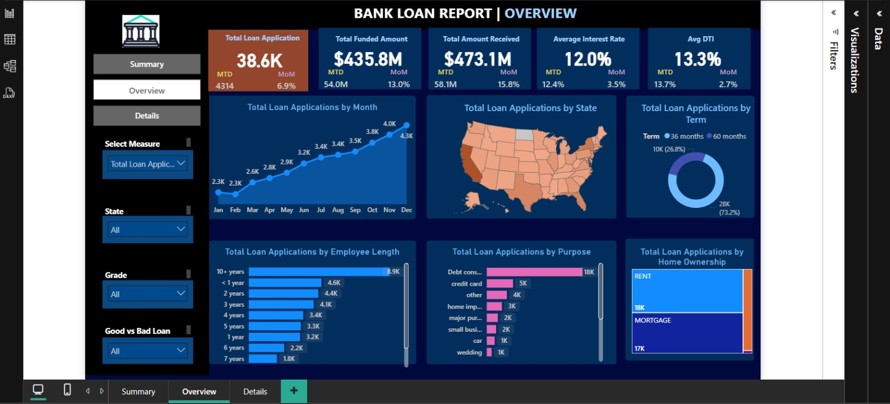
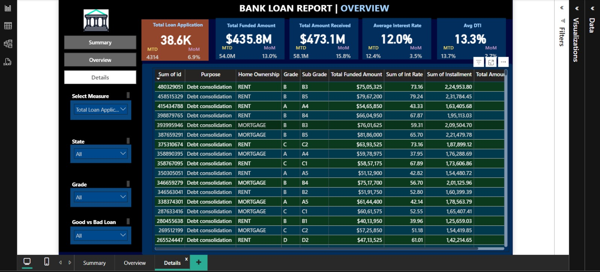

# Bank Loan Data Analysis (Power BI + SQL Project)

## 📊 Project Overview
This project analyzes bank loan data using Power BI for dashboard visualization and PostgreSQL for data extraction and query logic. The objective was to identify patterns in loan approvals, defaults, and applicant demographics.

---

## 🛠️ Tools Used
- **Power BI Desktop** – Dashboard creation and report visuals  
- **MySQL** – SQL queries for data manipulation  
- **MS Excel/CSV** – Raw data preprocessing

---

## 🔍 Key Features
- Created interactive dashboard showing **loan approval trends**, **applicant income distribution**, and **loan default risk**.
- Used **complex SQL queries** to join and filter tables before importing into Power BI.
- Enabled **drill-through and slicers** for branch-wise & status-wise filtering.
- Integrated visual KPIs, bar charts, pie charts & map visualizations.

---

## 📂 Project Files
- `Bank_Loan_Analysis.pbix` – Power BI dashboard file  
- `SQL_Queries_Documentation.docx` – All SQL queries used  
- `dashboard_screenshot.png` – Final dashboard preview  

---

## 📊 Power BI Dashboard Screenshots

### 📌 Summary

### 🖼️ Overview

### 📈 Details

---

## 🔗 How to Use
1. Download the `.pbix` file and open it in Power BI Desktop.
2. Review the SQL queries in the `.docx` file.
3. Connect to your dataset if needed, and refresh visuals.

---

## 📬 Contact
For any queries, reach out via [devawasthi2020@gmail.com]

